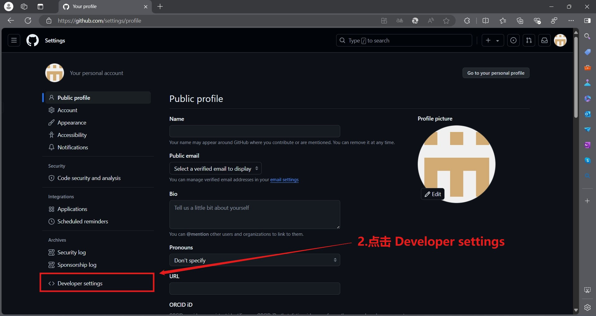
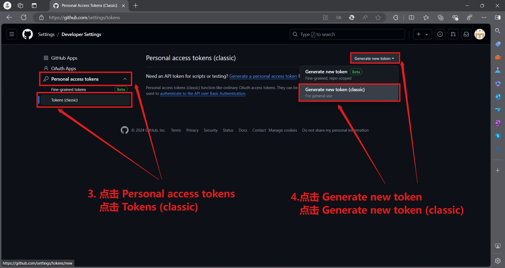

# sing-box-freebsd
用于测试自行变异sing-box 的 freebsd 版本

    
<a href="https://star-history.com/#20241204/sing-box-freebsd&Date">
  <picture>
    <source media="(prefers-color-scheme: dark)" srcset="https://api.star-history.com/svg?repos=20241204/sing-box-freebsd&type=Date&theme=dark" />
    <source media="(prefers-color-scheme: light)" srcset="https://api.star-history.com/svg?repos=20241204/sing-box-freebsd&type=Date" />
    
  </picture>
</a>

## 描述
0.最近发现 serv00.com 提供的服务器 freebsd amd64 无法执行编译构建 go 语言程序 sing-box 了，所以就上网上搜啊搜啊，结果呢，一个freebsd最新版本的sing-box够没有，我没办法，只能自行变异了，也是遭了不少罪啊，🥹  
1.为了实现 actions workflow 自动化 docker 构建运行，需要添加 `GITHUB_TOKEN` 环境变量，这个是访问 GitHub API 的令牌，可以在 GitHub 主页，点击个人头像，Settings -> Developer settings -> Personal access tokens -> Tokens (classic) -> Generate new token -> Generate new token (classic) ，设置名字为 GITHUB_TOKEN 接着要配置 环境变量有效时间，勾选环境变量作用域 repo write:packages workflow 和 admin:repo_hook 即可，最后点击Generate token，如图所示

  

2.赋予 actions[bot] 读/写仓库权限，在仓库中点击 Settings -> Actions -> General -> Workflow Permissions -> Read and write permissions -> save，如图所示

3.转到 Actions  

    -> Sing-box FreeBSD Build & Upload Artifacts 并且启动 workflow，实现自动化构建镜像并推送云端  

4.目录结构：

    .                                     # 这个是根目录
    ├── .github                           # 这个是github虚拟机项目
    │   └── workflows                     # 这个是工作流文件夹
    │       └── build.yml                 # 这个是docker构建编译流文件
    └── README.md                         # 这个是项目说明文件

# 看完注意后，构建运行 sing-box-freebsd ，也可以根据自定义需求爆改脚本

# 注意
多人 fork 本项目且一起运行 actions 时，可能会导致本人项目被ban掉，所以，你可以创建新项目，把文件复制过去，自己享用

# 声明
本项目仅作学习交流使用，用于查找资料，学习知识，不做任何违法行为。所有资源均来自互联网，仅供大家交流学习使用，出现违法问题概不负责。

## 感谢
github tag 推送与 release 发布：[https://juejin.cn/post/7101196005843927071](https://juejin.cn/post/7101196005843927071)  
github actions freebsd vm：[https://github.com/vmactions/freebsd-vm](https://github.com/vmactions/freebsd-vm)  
cloudflared freebsd 版本变异参考：[https://github.com/robvanoostenrijk/cloudflared-freebsd](https://github.com/robvanoostenrijk/cloudflared-freebsd)  
sing-box 源码开发者们：[https://github.com/SagerNet/sing-box](https://github.com/SagerNet/sing-box)  
sing-box 变异文档参考：[https://sing-box.sagernet.org/installation/build-from-source/](https://sing-box.sagernet.org/installation/build-from-source/)  
跨平台 go 交叉变异：[https://www.topgoer.com/%E5%85%B6%E4%BB%96/%E8%B7%A8%E5%B9%B3%E5%8F%B0%E4%BA%A4%E5%8F%89%E7%BC%96%E8%AF%91.html](https://www.topgoer.com/%E5%85%B6%E4%BB%96/%E8%B7%A8%E5%B9%B3%E5%8F%B0%E4%BA%A4%E5%8F%89%E7%BC%96%E8%AF%91.html)  
